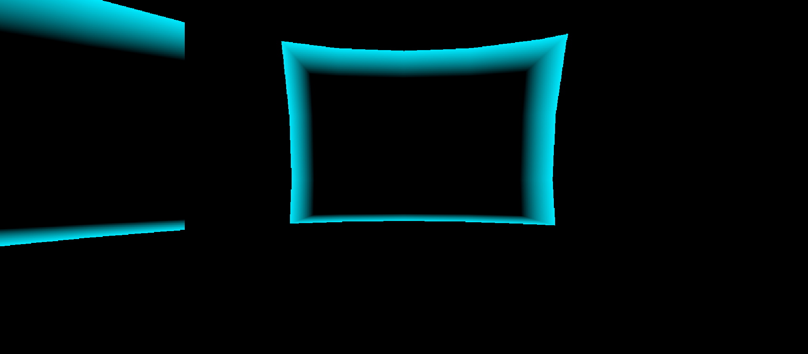

# Sonar Escape
VR-Головоломка/бродилка от первого лица с визуальным стилем и базовой механикой, основывающимися на игре Dark Echo (2015). 
## GDD
#### Концепция
VR-лабиринт от первого лица, заимствующий механику сонара из игры Dark Echo. В лабиринте очень темно и ничего не видно, поэтому игрок вынужден ориентироваться на визуализированный с помощью шейдера звук собственных шагов, отражающийся от стен и освещающий пространство вокруг себя на ограниченное количество времени
#### Визуальный стиль
- Стартовое меню и экран успешного прохождения лабиринта оформлены шрифтом, имитирующим пиксельный шрифт старых игр, в которых часто использовалась тема лабиринта

- Визуализируемое эхо выполнено в синем цвете, достаточно освещающем лабиринт, но не диссонирующем с ним

- Чтобы сделать прохождение лабиринта ещё приятнее, выбрана подходящая lo-fi/synthwave музыка
#### Жизненный цикл
- Начальное меню с возможностью начать первый уровень
- Появление на уровне в кромешной темноте
- Поиск выхода из лабиринта с ориентацией по визуализированному звуку собственных шагов
- Экран окончания игры
#### Механики
- Выбор "начать игру" в стартовом меню с помощью луча на левом контроллере и кнопки на правом
- Передвижение с помощью аналогового стика на любом из контроллеров
- Поворот с помощью поворота VR-шлема
- Визуализация звука шагов с помощью шейдера, который, как лучи, разбегается во все стороны от игрока